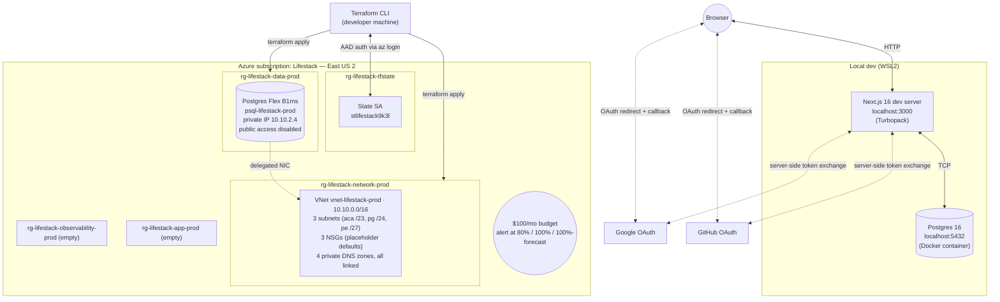
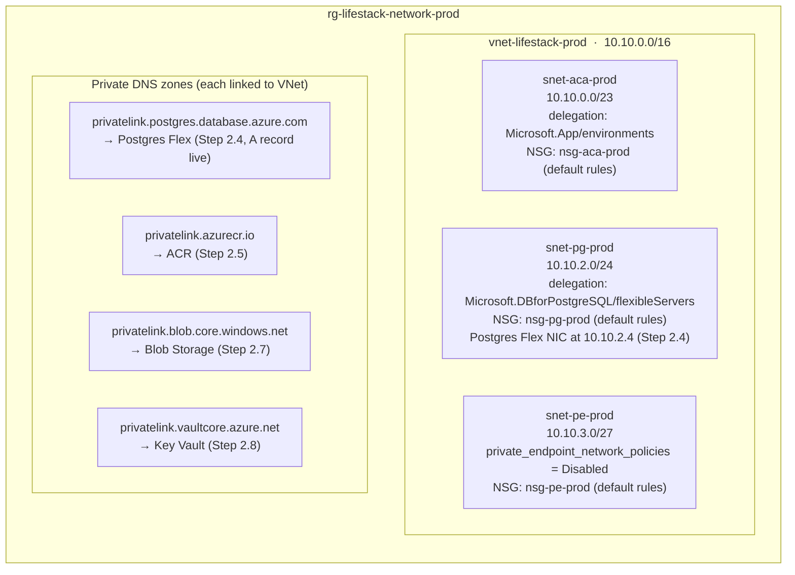

# Architecture

> Living document. The diagrams and the current-vs-target table are kept in step with reality — every architecture-changing step updates them before the step is considered done. The detailed network topology diagram lands with Step 2.3 (network module).

---

## High-level architecture diagram

### Current state (Phase 1 complete + Phase 2 steps 2.1–2.4)

The running application is still local; the Azure footprint now includes the network plumbing and the Postgres Flex server. The app still talks to local Docker Postgres in development — the Azure database stays unreached until Container Apps lands in Step 2.6. No app, storage, secrets, or observability resources are provisioned yet — those come in Steps 2.5–2.10.



### Target state (end of Phase 2 — v1 prod)

The application moves into Azure Container Apps. Internet traffic enters through Front Door; data services are reached privately via Private Endpoints. Resource groups are split by tier (network / data / app / observability / state) for permission and lifecycle separation.

```mermaid
flowchart TB
  Browser((Browser))

  subgraph AzureSub["Azure subscription: Lifestack — East US 2"]
    direction TB

    FD["Front Door Standard<br/>WAF · CDN · TLS"]

    subgraph NetRG["rg-lifestack-network-prod"]
      VNet["VNet vnet-lifestack-prod<br/>10.10.0.0/16<br/>3 subnets · 4 PE DNS zones"]
    end

    subgraph AppRG["rg-lifestack-app-prod"]
      ACAEnv["ACA env<br/>cae-lifestack-prod<br/>(workload profiles)"]
      ACAApp["ca-lifestack-web-prod<br/>Next.js container<br/>(scale-to-zero)"]
      ACR["ACR Standard<br/>crlifestack...."]
      ACAEnv --> ACAApp
      ACAApp -.->|pulls image| ACR
    end

    subgraph DataRG["rg-lifestack-data-prod"]
      Pg[("Postgres Flex B1ms<br/>psql-lifestack-prod")]
      Stor[("Blob Storage<br/>stlifestackimages....<br/>thumb / feed / full / original")]
      KV["Key Vault<br/>kv-lifestack-prod-...."]
    end

    subgraph ObsRG["rg-lifestack-observability-prod"]
      AI["App Insights<br/>appi-lifestack-prod"]
      LA["Log Analytics<br/>log-lifestack-prod"]
      AI --> LA
    end

    subgraph TfRG["rg-lifestack-tfstate"]
      State["State SA<br/>stlifestack9k3l"]
    end

    MI["Managed identity<br/>id-lifestack-web-prod"]
    ACAApp -.->|uses| MI
  end

  Browser -->|HTTPS| FD
  FD -->|HTTPS| ACAApp
  ACAApp -.->|VNet-integrated (delegated subnet)| Pg
  ACAApp -.->|Private Endpoint · AAD| Stor
  ACAApp -.->|Private Endpoint · AAD| KV
  ACAApp -.->|telemetry| AI
  FD -.->|diagnostics| LA
  Pg -.->|diagnostics| LA
  Stor -.->|diagnostics| LA
  ACAApp -.->|stdout/stderr| LA
```

Solid arrows are user/request traffic. Dotted arrows are private-network or telemetry connections. All five RGs live in the same subscription and the same region; resource groups separate concerns (permissions, lifecycle, blast radius), not boundaries.

> Diagrams are kept in step with reality. Each architecture-changing step (new tier, new service, deployment topology shift) updates these blocks before the step is considered done.

---

## Stack overview by layer

### Application layer

**Next.js 16 (App Router)**
The framework everything runs inside. Handles routing (a file in `app/` becomes a URL), server-side rendering, and the boundary between "code that runs on the server" and "code that runs in the browser." In this project it replaces what would otherwise be two separate things: a React frontend and a Node.js backend API. Because Next.js can run server-side code in the same codebase, database queries and auth checks live alongside the UI — no separate API service to run or maintain.

The App Router specifically means we use React Server Components by default. Most pages and data-fetching happen entirely on the server; only interactive bits (buttons that need state, dropdowns) get shipped to the browser.

**TypeScript (strict mode)**
JavaScript with a type system enforced at build time. Strict mode means: no implicit `any` types, no unchecked nulls, no skipping type annotations. TypeScript catches the class of bugs that would otherwise only surface at runtime — wrong field names, missing null checks, mismatched function signatures. Fast feedback loop that catches mistakes before a browser refresh.

**Tailwind CSS v4**
A utility-first CSS framework. Instead of writing `.button { padding: 8px; }` in a stylesheet, you write `className="p-2"` directly on the element. The practical benefit: you never context-switch to a CSS file, and unused CSS is purged at build time. V4 moves all configuration into CSS itself — no `tailwind.config.ts` in this project; theme tokens live in `app/globals.css` under `@theme inline`.

**shadcn/ui**
A collection of pre-built accessible UI components (buttons, cards, dialogs, dropdowns, forms) copied directly into `components/ui/` rather than installed as a dependency. Because the component code lives in the repo, it can be read, modified, and understood — no black-box npm package. Upstream updates are pulled manually when wanted.

**React Hook Form + Zod**
Two libraries that solve form handling together. Zod defines the shape and validation rules for data as a TypeScript schema ("username must be 3–20 chars, no spaces"). React Hook Form connects that schema to HTML form elements and manages validation state, error messages, and submission. Zod schemas are shared between client-side form validation and server-side action validation — rules written once, enforced in both places.

**Prisma**
The ORM (Object-Relational Mapper) — the layer between TypeScript code and PostgreSQL. Instead of writing SQL strings, you write TypeScript: `prisma.user.findUnique({ where: { id } })`. Prisma generates a type-safe client from `prisma/schema.prisma`, so the return type of a database query matches exactly what the schema says is there. Also handles migrations: when the schema changes, Prisma generates and runs the SQL to bring the database in line.

**Auth.js v5 (next-auth@beta)**
Authentication library. Handles the full OAuth flow with Google and GitHub: redirect to the provider, receive the callback, exchange the auth code for a user profile, create or find the user in the database, issue a session. Also handles CSRF protection, session storage, and the session-check proxy. OAuth has subtle security requirements where a small mistake means account takeover vulnerabilities — the library implements these correctly so the application code doesn't have to.

**Sharp**
A Node.js image processing library. Used when users upload photos: resize to multiple dimensions (thumbnail, feed, full), strip EXIF metadata (which can contain GPS coordinates — a PII concern), optimize compression. Runs on the server only. Not wired up until Phase 11, but installed early because Next.js's built-in image optimization uses it internally.

**Lucide React**
Icon set. SVG icons as React components, used by shadcn's default component designs.

---

### Data layer

**PostgreSQL**
*Local dev:* Docker container. *Production:* Azure Database for PostgreSQL Flexible Server (B1ms tier).

The primary database. Stores all application data: users, products, reviews, ownership records, the social graph. PostgreSQL over MySQL or SQLite because: strong support for JSON columns (used for hobby-specific attributes via EAV pattern — see ADR-0006), native `pgvector` extension support (vector search for taste-twin recommendations in v3), and it's what Azure's managed offering runs — local dev and production run the same engine.

The Flexible Server tier on Azure gives per-instance control over VM size, maintenance windows, and high availability configuration — unlike the deprecated Single Server model which hid those knobs.

**Azure Blob Storage**
Object storage for binary files — user-uploaded images. Azure's equivalent of S3. Images go here instead of Postgres because databases are not designed for high-throughput binary serving (it saturates connection pools and DB CPU). Object stores handle this natively and integrate directly with CDN. Separate containers per image size: `thumb/`, `feed/`, `full/`, `original/`.

**pgvector (deferred until v3)**
A PostgreSQL extension that adds a vector column type and approximate nearest-neighbor search. Planned for the taste-twin feature: store a numerical embedding for each user's taste profile, then find users with similar vectors across hobby boundaries. The extension is installed in the DB schema now to avoid a migration later; no application code uses it until v3.

---

### Infrastructure layer

**Azure Container Apps**
Where the Next.js app runs in production. Serverless container hosting — provide a Docker image, and Container Apps handles the cluster, load balancing, TLS (to the backend), and scaling. Scale-to-zero means when no requests arrive, the instance scales down and stops billing for compute. The tradeoff is cold start latency on first request after idle.

Sits above AKS (no Kubernetes cluster to manage) and above App Service (containers instead of app deployment slots). The right abstraction for a containerized workload that doesn't need Kubernetes-level control.

**Azure Container Registry**
Private Docker image registry. GitHub Actions builds the Docker image and pushes it here; Container Apps pulls from here on deploy. Keeps images private and in the same Azure region as the app.

**Azure Front Door Standard**
The edge layer — the first thing the internet hits before traffic reaches Container Apps. Provides: TLS termination (HTTPS), a global CDN for static assets, WAF (Web Application Firewall) for basic threat protection, and a stable public hostname that doesn't change when containers are redeployed. Traffic flow: browser → Front Door → Container Apps. Application Gateway is skipped in v1 (see ADR-0004).

**Azure Key Vault**
Secret store. Database passwords, OAuth client secrets, API keys — none live in `.env` files or environment variables set at deploy time. The Container Apps instance has a managed identity; at startup it reads secrets from Key Vault using that identity. Secret rotation means updating Key Vault only; the app picks up the new value on next start without a redeploy.

This is the managed identity + Key Vault pattern: no credentials stored in the app or its config, no IAM keys to rotate, no risk of secrets leaking through environment variable inspection.

**Application Insights + Log Analytics workspace**
Unified observability. Application Insights handles distributed tracing — every server action and route handler creates a span with structured properties. Log Analytics is the sink: Front Door, Container Apps, PostgreSQL, and Blob Storage all ship logs to the same workspace, making cross-component queries possible from a single place. See `docs/operations/observability.md` for what we log, key queries, and dashboard locations.

**Terraform**
Infrastructure as Code. Every Azure resource is defined in `.tf` files under `infra/`. `terraform apply` creates or updates actual Azure resources to match the definition. Infrastructure is reproducible, reviewable in Git, and can be destroyed and recreated exactly. Reusable modules (network, Container Apps, Postgres, storage, monitoring) mean adding a dev or staging environment is a matter of instantiating the same modules with different variables.

**GitHub Actions**
CI/CD pipelines. Two separate workflows: infrastructure (runs Terraform on changes to `infra/`) and application (builds the Docker image, pushes to ACR, triggers a Container Apps deployment on merge to main). Also runs type checks and tests on PRs.

---

### Integration layer

**Resend**
Transactional email. Password reset links, email verification, notification emails. Free tier covers v1 volume. API is simple and the developer experience is straightforward. Not wired up until a feature requires email.

---

## Data flow: typical page request

```
Browser
  → Front Door (TLS termination, WAF, CDN cache check)
    → Container Apps (Next.js server)
      → Prisma → PostgreSQL (page data)
      → [images served separately via Blob Storage → Front Door CDN]
      → Application Insights (request span)
    ← HTML streamed back through Front Door to browser
```

A user visiting a product page: Front Door receives the HTTPS request, checks the CDN for static assets (JS bundles, fonts), and routes the page request to the Container Apps instance. Next.js renders a server component — that component calls Prisma to fetch the product from Postgres, renders HTML, and streams it back. Product images linked in the HTML are served directly from Blob Storage through Front Door's CDN, never touching the app server.

## Data flow: mutation (form submit / server action)

```
Browser (client component calls server action)
  → Next.js server (server action runs)
    → Prisma → PostgreSQL (write)
    → Application Insights (action span)
  ← Result returned, UI updated
```

Server actions bypass Front Door's CDN (POST requests are not cached). They run server-side, validate input via Zod, write to Postgres through Prisma, and return a typed result to the calling component.

---

## Current state vs target state

| Layer | Current (mid Phase 2) | Target (end of Phase 2) |
|---|---|---|
| Subscription | `Lifestack` provisioned, 9 resource providers registered (Step 2.1) | unchanged |
| Cost guardrail | $100/month subscription budget with alerts at 80/100% actual + 100% forecast (Step 2.2.1) | unchanged |
| IaC | Terraform state backend + prod env + 4 prod RGs + budget + network + Postgres modules applied (Step 2.2 → 2.4) | All v1 resources defined as Terraform modules and applied to prod |
| Region | `eastus2` (originally `eastus` until `LocationIsOfferRestricted` on Postgres Flex forced a move in Step 2.4) | unchanged |
| Network | VNet `10.10.0.0/16` in `rg-lifestack-network-prod` with 3 delegated/restricted subnets and 4 linked private DNS zones (Step 2.3) | Same — downstream modules wire private endpoints into `snet-pe-prod` |
| App | Running locally via `pnpm dev` against Docker Postgres | Containerized, deployed to Container Apps with workload profiles + scale-to-zero, talking to Postgres Flex over the VNet |
| Database | **Azure Postgres Flex B1ms** in `rg-lifestack-data-prod`, public access disabled, NIC at `10.10.2.4` in `snet-pg-prod`, `vector` extension allowlisted (Step 2.4). App still points at local Docker Postgres until Container Apps lands. | Same — Container Apps consumes the connection string from Key Vault |
| Storage | Not configured | Blob Storage with private endpoint, separate containers for image sizes |
| Edge | None | Front Door Standard with WAF |
| Secrets | `.env.local` | Key Vault accessed via managed identity over private endpoint |
| Observability | Console / browser devtools | App Insights + Log Analytics workspace, all components shipping logs |
| CI/CD | Not started | GitHub Actions — separate infra and app pipelines |

Each row moves from Current to Target as the corresponding Phase 2 sub-step completes. The "Current" column is updated every step to reflect what is actually deployed.

---

## Network topology

The VNet is the private-network boundary for the v1 architecture. Three subnets serve different purposes (compute, database, private endpoints) and have different posture (delegations, NSGs, PE-network-policies). Four private DNS zones, all linked to the VNet, make `*.privatelink.*` lookups resolve to the right private IPs as PEs come online in Steps 2.4–2.8.



Subnet sizing rationale, address-space choice, and the NSG strategy are explained in `docs/services/azure-network.md`. The Private Endpoint NICs that consume the four DNS zones land in `snet-pe-prod` as each downstream module is deployed.
